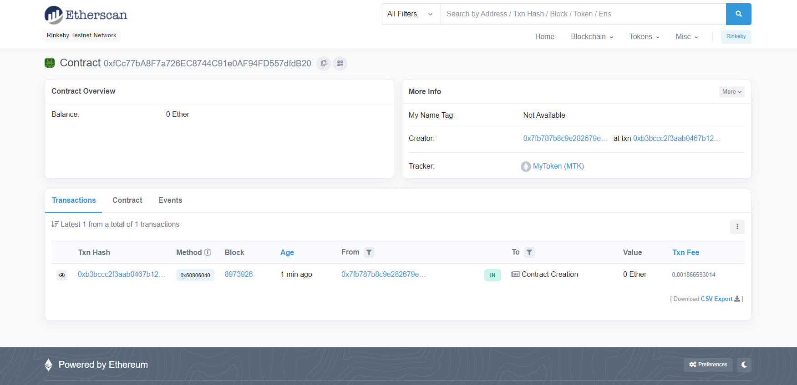
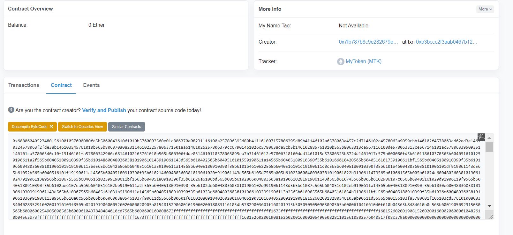
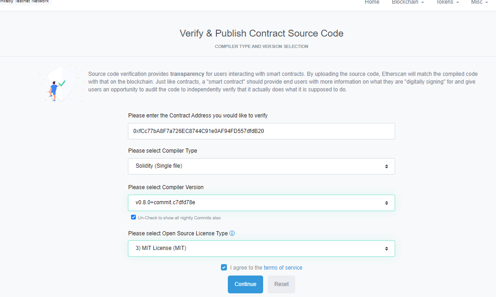

# ERC 20 Token_Creation

This is the ERC 20 contract template for creating custom tokens.

<br>

## Steps To Run and deploy the contract 

Clone the Repo

```
git clone 
```

cd Into the directory
```
cd Token_Creation
```

Install the project
``` 
npm install
```

## Compile the contract

To compile the contract, just go

```
npx hardhat compile
```

If you get any error while compiling like, hardhat not installed locally, then use
```
npm install --save-dev @nomiclabs/hardhat-waffle ethereum-waffle chai @nomiclabs/hardhat-ethers ethers
```
OR
```
npm install @nomiclabs/hardhat-waffle ethereum-waffle chai @nomiclabs/hardhat-ethers ethers
```
<br>

## Testing Contract

In a new terminal start a local blockchain using
```
npx hardhat node
```

To test:
```
npx hardhat test --network localhost
```

## Configuring Deployment

Now to deploy the NFT contract on the Rinkeby Testnet.

First, make sure you get some rinkeby testnet Ether.  You can get some here: https://faucet.rinkeby.io/

Next, set up a rinkeby provider. You can get one from https://alchemyapi.io or from https://infura.io/

It should look like: https://eth-rinkeby.alchemyapi.io/v2/......

Next, configure **module.exports** in *hardhat.config.js*.
You must add your own account private key and provider url to the config
<br>

## Deploy Contract

First, you must write a deploy script. Go to *scripts/deploy.js* in the scripts folder.

Inside function main(), add the code to deploy your contract

```
async function main() {
    const MyToken = await hre.ethers.getContractFactory("MyToken");
    const mytoken = await MyToken.deploy();
    await mytoken.deployed();
}
```

If everything is configured properly, you can now deploy. In your terminal, run the deploy command

```
npx hardhat run --network rinkeby scripts/deploy.js
```

To see if your contract has been deployed, check your account in etherscan.io.

A new transaction should appear, and the transaction should deploy a new contract!

<br>
<p align="center"></p>
<br>

## Verify on Etherscan

To verify your contract on etherscan, you must first flatten your entire contract.

```
npx hardhat flatten > flattenedContracts/flattenedNFTbase.sol
```

Take the code, and clean it up, then verify it on etherscan.
<br>

> **Note:** For cleaning delete all the multiple instances of **SPDX-License-Identifier** and **pragma solidity**.
<br>

## Steps to verify
1. Go to *contract* tab and click on **Verify and Publish**

<p align="center"></p>
<br>

2. Now here select the options provide in this example:

<p align="center"></p>

<br>
## Play with your new NFT contract

   - Mint tokens
   - Transfer Tokens